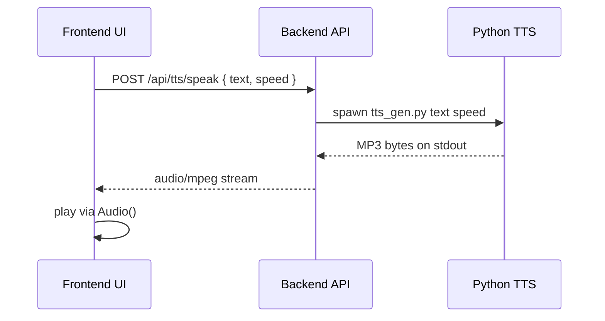

# Architecture and Design

This document describes the system architecture for the Accessible Language Learning Platform in this repository.

## Stack

- Frontend: React (Create React App)
- Backend: Node.js + Express
- Database: MongoDB (via Mongoose)
- Auth: JWT (Bearer token)
- Optional services:
  - Text-to-Speech (TTS): Python script invoked from the backend
  - AI quiz generation: Google Gemini (with safe fallback responses)
  - Lesson search: vector search helper with text-search fallback

## Repository layout

Top-level:

- `frontend/`: React application
- `backend/`: Express API server
- `generate-audio-files.js`, `create-placeholder-audio.js`: utility scripts

Backend (`backend/`):

- `server.js`: Express app bootstrap and route mounting
- `routes/`: HTTP endpoints grouped by domain
- `controllers/`: route handlers (domain logic)
- `models/`: Mongoose models (MongoDB collections)
- `middleware/`: auth and authorization middleware
- `services/`: helpers (example: vector search)
- `python_services/`: Python utilities (example: TTS generator)

Frontend (`frontend/src/`):

- `components/`: pages and UI components
- `components/learning/`: lesson delivery views (Dyslexia, ADHD, Autism, lesson player)
- `context/`: React contexts (auth, preferences, theme)
- `services/`: API wrappers for lessons, sections, interactions, progress
- `utils/api.js`: Axios instance with auth token interceptor

## Runtime topology

In local development the system typically runs as:

- Frontend dev server: `http://localhost:3000`
  - Proxies `/api` to the backend (`frontend/package.json` `proxy`)
- Backend API server: `http://localhost:5002`
- MongoDB: local instance or Atlas
- Optional Python runtime for TTS

## Request and auth flow

1. User logs in via `POST /api/auth/login`.
2. Frontend stores the JWT (localStorage) and uses it for subsequent API calls.
3. Frontend Axios client in `frontend/src/utils/api.js` attaches `Authorization: Bearer <token>`.
4. Backend middleware `backend/middleware/auth.js` validates the token and populates `req.user`.

## Core domain modules

### Preferences (accessibility settings)

- Data model: `Preferences` (one per user) referenced by `User.preferences`.
- Backend endpoints: `/api/preferences/*`.
- Frontend responsibility:
  - Fetch preferences after login
  - Apply preferences to the UI (themes, spacing, fonts)

### Lessons and sections

- Data models:
  - `Lesson`: top-level lesson content and optional interactions
  - `LessonSection`: ordered sections per lesson (`lessonId` + `order`)
- Backend endpoints:
  - `GET /api/lessons/:id` for a lesson
  - `GET /api/lessons/:lessonId/sections` for section list
  - `GET /api/lessons/search?q=...` for searching

### Interactions (practice questions)

- Data model: `UserInteraction` stores attempts and correctness per user and lesson.
- Backend endpoints:
  - `POST /api/interactions/submit`
  - `POST /api/interactions/help`
- Key behavior:
  - Attempts are capped by `maxAttempts` from the lesson interaction definition.
  - Help returns hint or explanation depending on attempt count and content.

### Progress tracking

- Data model: `UserProgress` stores per-user, per-lesson progress and completion.
- Backend endpoints:
  - `GET /api/progress/:lessonId` restore/load progress
  - `POST /api/progress/update` auto-save progress
  - `GET /api/progress/summary` progress summary
- Additional completion store:
  - `User.completedLessons` and `User.completedLessonsMeta` provide a lightweight completion history and support non-database lesson keys.

## Audio and TTS design

The platform supports audio in two ways:

1. Pre-recorded audio URLs (when available)
   - Lessons/sections can carry `audioUrl` fields.
   - Frontend plays them via the browser audio element.

2. Backend TTS endpoint
   - Frontend calls `POST /api/tts/speak` with `text` and optional `speed`.
   - Backend runs `backend/python_services/tts_gen.py` and streams MP3 bytes (`audio/mpeg`).
   - Frontend can fall back to the browser SpeechSynthesis API when needed.

Mermaid sequence diagram (TTS):

## AI quiz generation (optional)

- Backend endpoint group: `/api/ai/*`
- Implementation uses Gemini when `GEMINI_API_KEY` is configured.
- When the key is missing or the call fails, the backend returns a mock quiz payload so the UI remains usable.

## Dev-only utilities

When `NODE_ENV !== 'production'`, the backend mounts dev routes:

- `POST /api/dev/create-test-lesson`

This is useful for quickly seeding a lesson and section list during development.

## Error handling and reliability

- Route handlers return appropriate status codes:
  - 400 for validation failures
  - 401 for missing/invalid auth
  - 403 for forbidden
  - 404 for missing resources
  - 500 for unexpected server errors
- Backend includes a global error handler in `backend/server.js`.

## Notes for future diagrams

If you want a single-page diagram, a good next step is to add a component diagram showing:

- Frontend pages and contexts
- API routes grouped by domain
- Database collections and relationships
- External services (Gemini, Python TTS)
