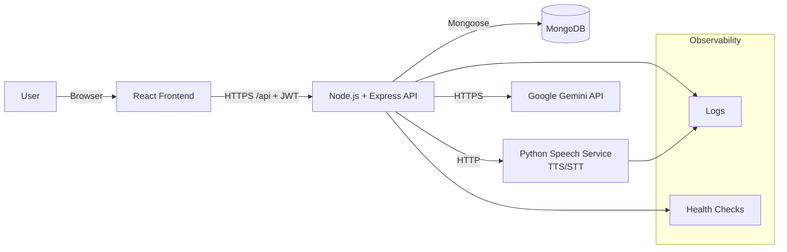
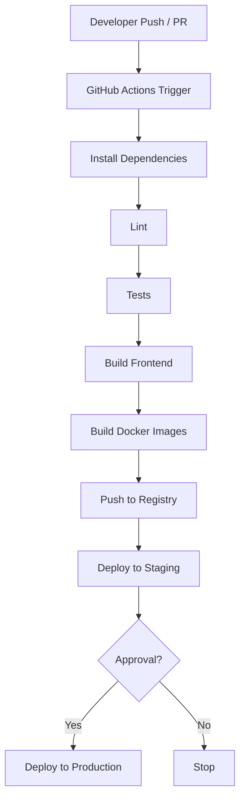

# DevOps Strategy Document

Project: Accessible Language Learning Platform for Learners with Learning Disabilities

Target Users: Learners with Dyslexia, ADHD, and Autism

Supported Languages: English, Tamil, Malayalam, Telugu, Hindi

Tech Stack:

- Frontend: React
- Backend: Node.js + Express
- Database: MongoDB
- Speech Services: Python service for Text-to-Speech (TTS) and Speech-to-Text (STT)
- AI Services: Google Gemini API
- Authentication: JWT-based authentication
- Deployment: Docker-based containerization
- CI/CD: GitHub Actions

## 1. DevOps Strategy Overview

### 1.1 Purpose of DevOps for this project

DevOps practices help this project deliver frequent, reliable improvements while keeping the platform stable and accessible for learners who may be sensitive to inconsistent UI behavior or interruptions.

For a learning platform, DevOps focuses on:

- Repeatable builds and deployments
- Early detection of defects (CI checks on every change)
- Reliable runtime behavior (health checks, basic monitoring)
- Safe releases (staging first, rollback plan)

### 1.2 Importance of automation, reliability, and accessibility

Automation reduces manual errors and ensures consistent outcomes across different machines.

Reliability is essential because learners benefit from predictable interaction flows (especially in autism-friendly views) and consistent audio delivery.

Accessibility is a product requirement and an operational requirement:

- CI checks prevent regressions in UI behavior
- Controlled releases reduce downtime or broken features
- Observability (logs/health checks) helps quickly fix issues affecting accessibility features

## 2. Architecture Overview

### 2.1 High-level system architecture

The platform uses a standard MERN structure:

- React frontend provides the learner experience and accessibility UI
- Node/Express backend provides authentication and learning APIs
- MongoDB stores users, preferences, lessons, sections, interaction states, and progress
- Python speech service provides TTS and STT capabilities
- Gemini API supports selected intelligent features (with safe fallbacks)

### 2.2 Interaction between components

The typical runtime flow:

- Frontend calls backend APIs using JWT bearer authentication.
- Backend reads/writes MongoDB via Mongoose models.
- Speech:
  - For TTS: backend can call the Python speech service (recommended) or invoke a Python process internally.
  - For STT (future or selected features): backend calls the speech service to transcribe audio.
- AI:
  - Backend calls Gemini API for specific endpoints.
  - If Gemini is not configured, backend returns mock fallback outputs to keep the UI usable.

### 2.3 Architecture diagram (Mermaid)



## 3. Component Summary

| Component | Technology | Responsibilities |
| --- | --- | --- |
| Frontend | React (CRA), Axios | Learner UI, accessibility views, preference application, calls backend APIs |
| Backend API | Node.js, Express | Auth (JWT), preferences API, lesson/section APIs, interaction APIs, progress tracking, integrates speech and AI |
| Database | MongoDB (Atlas or local), Mongoose | Persist user accounts, preferences, lesson content, progress, interactions |
| Speech Service | Python (TTS/STT) | Generate audio from text (TTS), transcribe speech to text (STT), language-specific voice handling |
| AI Service | Google Gemini API | Generate selected intelligent content (example: quiz questions), fallback output when unavailable |

## 4. CI/CD Pipeline

### 4.1 Pipeline triggers

Recommended triggers:

- Pull requests to `main`: run CI checks (lint/test/build)
- Push to `main`: run CI checks, build containers, optionally deploy to staging
- Release tags (optional): deploy to production

### 4.2 Pipeline stages

A student-appropriate pipeline for this repo:

1. Checkout source
2. Install dependencies
3. Lint (optional baseline)
4. Run tests (if present)
5. Build frontend
6. Build Docker images (frontend, backend, speech service)
7. Push images to registry (GitHub Container Registry)
8. Deploy (staging), then manual approval for production

### 4.3 Pipeline flow diagram (Mermaid)



## 5. GitHub Actions Workflow (Sample)

Below is a simple CI workflow example for a MERN-style project using Node. It builds both backend and frontend. Add this file as `.github/workflows/ci.yml` if you choose to implement it.

```yaml
name: CI

on:
  pull_request:
    branches: [ "main" ]
  push:
    branches: [ "main" ]

jobs:
  build:
    runs-on: ubuntu-latest

    strategy:
      matrix:
        node-version: [18]

    steps:
      - name: Checkout
        uses: actions/checkout@v4

      - name: Setup Node
        uses: actions/setup-node@v4
        with:
          node-version: ${{ matrix.node-version }}
          cache: npm

      - name: Install backend deps
        working-directory: backend
        run: npm ci

      - name: Install frontend deps
        working-directory: frontend
        run: npm ci

      - name: Build frontend
        working-directory: frontend
        run: npm run build
```

Notes:

- If you later add unit tests, include `npm test -- --watchAll=false` steps.
- If you add linting, include `npm run lint`.

## 6. Deployment Strategy

### 6.1 Local development workflow

Local development uses two terminals:

- Backend:
  - `cd backend`
  - `npm run dev`
- Frontend:
  - `cd frontend`
  - `npm start`

Local MongoDB can be used, or MongoDB Atlas.

For speech services:

- Option A (recommended): run the Python speech service as a separate container and call it over HTTP.
- Option B (current common pattern): backend invokes a Python script directly for TTS.

### 6.2 Staging deployment

Staging is a production-like environment used to validate:

- Authentication
- Preferences persistence
- Lesson rendering and interaction flows
- Audio generation and playback
- Progress tracking

Recommended staging characteristics:

- MongoDB Atlas database separate from production
- Non-production Gemini API key (or disabled)
- Lower-cost resources

### 6.3 Production deployment

Production focuses on reliability and predictable performance:

- MongoDB Atlas (managed database)
- Docker containers for frontend, backend, and speech service
- Stable environment variables and secrets management
- Basic monitoring and alerting

### 6.4 Docker and Docker Compose

Recommended services:

- `frontend`: React static build served by a web server container
- `backend`: Express API container
- `speech`: Python container providing `/tts` and `/stt` endpoints
- `mongo`: local only (for local dev). For staging/production prefer Atlas.

Example Compose structure (conceptual):

```yaml
services:
  frontend:
    build: ./frontend
    ports:
      - "3000:80"
    environment:
      - REACT_APP_API_URL=http://localhost:5002/api

  backend:
    build: ./backend
    ports:
      - "5002:5002"
    environment:
      - PORT=5002
      - MONGODB_URI=${MONGODB_URI}
      - JWT_SECRET=${JWT_SECRET}
      - JWT_EXPIRE=7d
      - GEMINI_API_KEY=${GEMINI_API_KEY}
      - GEMINI_MODEL=${GEMINI_MODEL}
      - SPEECH_SERVICE_URL=http://speech:8000

  speech:
    build: ./speech
    ports:
      - "8000:8000"
```

Notes:

- For staging/production, set `MONGODB_URI` to MongoDB Atlas.
- In production, expose only frontend publicly; backend can be behind a gateway or firewall.

## 7. Tools and Platforms

### 7.1 Development tools

- VS Code
- Node.js and npm
- MongoDB (local) or MongoDB Atlas
- Postman or curl (API testing)
- Python 3 (speech services)

### 7.2 CI/CD tools

- GitHub Actions for CI
- Optional: GitHub Container Registry (GHCR) for Docker images

### 7.3 Deployment tools

Student-appropriate options:

- Docker and Docker Compose
- A container host (Render, Railway, Fly.io, or a university VM)
- MongoDB Atlas

### 7.4 Monitoring tools (basic)

- Backend logs (stdout) collected by the hosting platform
- Health checks:
  - `/health` and `/api/health` endpoints on backend
- Optional:
  - Uptime monitoring (UptimeRobot)
  - Simple error tracking (Sentry) if allowed

## 8. Environment Configuration

### 8.1 Environment variables

Use environment variables to configure:

- Ports and base URLs
- Database connection
- JWT secrets
- External API keys (Gemini)
- Speech service configuration

### 8.2 Secrets management using GitHub Secrets

Store secrets in GitHub:

- `MONGODB_URI`
- `JWT_SECRET`
- `GEMINI_API_KEY`
- Any container registry tokens (if pushing images)

In workflows, inject them as environment variables.

### 8.3 .env file usage

Local development:

- Backend uses `backend/.env`
- Frontend uses `REACT_APP_*` variables during build time when required

Do not commit real secrets to Git.

## 9. Monitoring and Reliability

### 9.1 Basic logging strategy

- Backend: log requests and errors
- Speech service: log processing errors and request summaries
- Avoid logging:
  - passwords
  - JWTs
  - raw user private data

### 9.2 Error handling approach

- Use consistent HTTP status codes:
  - 400 for invalid inputs
  - 401 for unauthenticated
  - 403 for forbidden
  - 404 for missing resources
  - 500 for unexpected failures
- Provide user-friendly error messages on the frontend.
- Use fallbacks where appropriate:
  - Gemini endpoints can return mock outputs when AI is unavailable.
  - Browser speech synthesis can act as a fallback when server TTS is unavailable.

### 9.3 Health checks

Minimum checks:

- Backend:
  - `GET /health`
  - `GET /api/health`
- Speech service:
  - `GET /health` (recommended to implement)

Health checks allow container orchestration or hosting platforms to restart unhealthy services.

## 10. Rollback and Recovery Strategy

### 10.1 Handling failed deployments

- Staging first: deploy to staging and verify core flows.
- If staging fails:
  - stop promotion to production
  - fix the issue and redeploy

### 10.2 Simple rollback procedure

Container-based rollback:

1. Keep the previously deployed Docker image tag (example: `backend:previous`).
2. If a release fails in production, redeploy the last known good image.
3. Verify health endpoints and perform a short smoke test:
   - login
   - load a lesson
   - check progress summary
   - test audio playback

Database rollback:

- Prefer forward-fixes for schema changes.
- For destructive changes, take a backup (Atlas snapshots) before production deployments.

## 11. Conclusion

This DevOps strategy supports a student-built but well-engineered platform by:

- Automating quality checks and builds with GitHub Actions
- Standardizing deployment with Docker
- Protecting configuration through environment variables and GitHub Secrets
- Providing reliability through health checks, logging, and safe fallbacks

These practices help the platform scale responsibly while preserving accessibility and predictable learning experiences for learners with dyslexia, ADHD, and autism.
